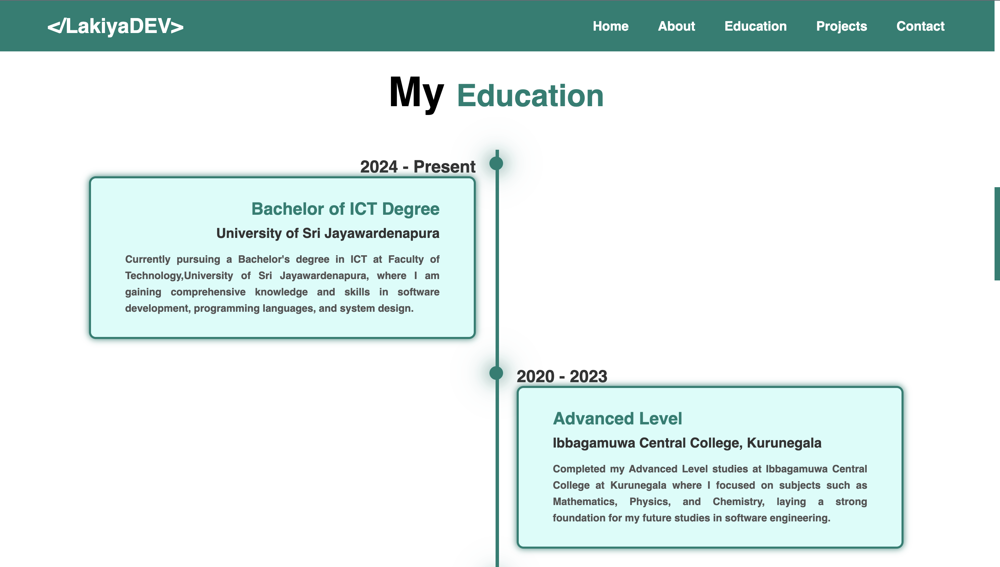

# 🌐 Personal Portfolio Website

This is a simple and responsive **Personal Portfolio Website** built using **HTML** and **CSS** for **Web Development** module in the university..  
It highlights my skills, projects, and contact information with a clean and modern design.

---

## 🖼️ Project Preview

Here are a few screenshots of my portfolio website:

<b>Home Page</b> 
   
<b>About Me Page </b> 
   
<b>Education Page</b> 
   
<b>Projects Page</b> 
   
<b>Contact Me Page </b> 

---
## 🖥️ Features

- Fully responsive layout for all screen sizes  
- Simple and elegant design  
- Separate sections for:
  - **About Me**
  - **Education**
  - **Projects**
  - **Contact**
- Easy to customize content and styles

---

## 🛠️ Technologies Used

- **HTML5** – Provides the structure  
- **CSS3** – Handles the styling and layout  
- **Google Fonts** and **Font Awesome** for better typography and icons

---

## 📬 Contact

If you’d like to connect or give feedback:

- **👤 Name:** Sadeepa Lakshan Bandaranayaka  
- **📧 Email:** [sadeepal319@gmail.com](mailto:sadeepal319@gmail.com)  
- **💼 LinkedIn:** [linkedin.com/in/sadeepa-lakshan-bandaranayaka-37b75b288](https://www.linkedin.com/in/sadeepa-lakshan-bandaranayaka-37b75b288)  
- **🐙 GitHub:** [github.com/LakiyaDev](https://github.com/LakiyaDev)

